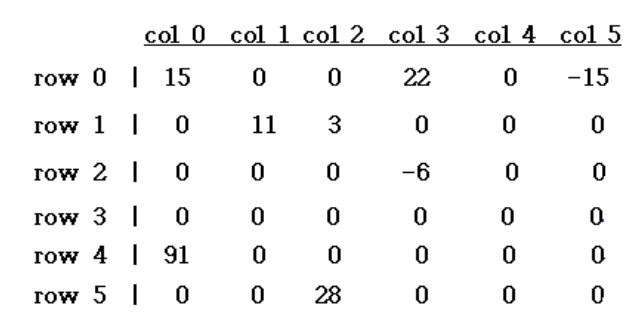

# Sparse Matrix

## ADT

- 희소 행렬 : 0이 많은 행렬


→ 만약 2차원 배열을 사용하면 낭비하는 칸이 많다.

> **ADT** SparseMatrix

**Objects** : 3원소 쌍 <행, 열, 값>의 집합이다. 여기서, 행과 열은 정수이고 이 조합은 유일하며, 값은 item 집합의 원소이다

**Functions**:
    모든 a, b ∈ SparseMatrix / x ∈ item / i, j, maxCol, maxRow ∈ index

> 
> 
> 
> *SparseMarix*  `Create(maxRow, maxCol)`
>     **return** maxItems 까지 저장할 수 있는 SparseMatrix 
> 
> *SparseMarix*  `Transpose(a)`
>     **return** 모든 3원소 쌍의 행과 열의 값을 교환한 행렬
> 
> *SparseMarix*  `Add(a, b)`
>     **if** a와 b의 차원이 같으면
>          **return** 두 행렬을 더한 값
>     **else return** 에러
> 
> *SparseMarix*  `Multiply(a, b)`
>     **if** a의 열의 수와 b의 행수가 같으면
>         **return** 두 행렬을 곱한 값
>     **else return** 에러
> 

### Sparse Matrix Representation

- <row, col, value> 값을 가지고 있는 term의 모음 → 0이 아닌 위치의 값만 알면 됨.
    - a[0] 에는 행렬의 크기, 0이 아닌 term의 갯수

- *Sparse*_*Matrix* `Create(max_row, max_col)`  ::=

```c
#define MAX_TERMS 101 // 최대 term수 (100) + 1
typedef struct {
	int col;   // 열
	int row;   // 행
	int value; // 값
} term; 
term a[MAX_TERMS]; 
```

- 행렬의 전치 → 행과 열을 바꾸는 것


→ 행렬 A


→ 행렬 A 를 배열로 나타낸 것


→ 행렬 A의 전치를 배열로 나타낸 것

<Simple Algorithm>

```c
for each row i // 각 행 i 에 대해
	take element <i, j, value> and store it // 한 term 을 가지고
	as element <j, i, value> of the transpose; // 행과 열을 바꾸어 저장
```

→ 문제점 : 행과 열을 바꾸면 순서가 유지되지 않음

→ for loop를 i 에서 j 로 바꾸기 

```c
for all elements in column j // 각 행 j에 대해
	place element <i, j, value> in element <j, i, value>; // 행과 열을 바꾸어 저장
```

- [Program 2.8] : Transpose of Sparse Matrix

```c
void transpose(term a[], term b[]){ // 2개의 행렬 a, b & b는 a의 전치된 행렬
	int n = a[0].value;  // 총 term의 갯수
	int i, j; // loop에 사용할 변수
	int currentb; // 전체 term 중 몇 번째 인지 저장할 곳
	b[0].row = a[0].col; // b의 행 = a의 열
	b[0].col = a[0].row; // b의 열 = a의 행
	b[0].value = n; // 0의 아닌 값의 갯수 저장
	
	if(n > 0) { // term의 갯수가 0개가 아니면 = 영행렬이 아니면
		currentb = 1; // 첫 번째 term부터 채워나가기
		for(i = 0; i < a[0].col; i++)  // a의 열 순서대로
			for(j = 0; j < n; j++) // 비어있지 않은 수를 차례대로 체크
				if(a[j].col == i) { // 행&열이 맞는지 체크
					b[currentb].row = a[j].col; // a의 열을 b의 행에 저장
					b[currentb].col = a[j].row; // a의 행을 b의 열에 저장
					b[currentb].value = a[j].value; // a의 값을 b에 저장
					currentb++; // b의 위치를 옮김
				}
	}
}	
```

→ 시간 복잡도 : O(열의 갯수 · term의 갯수) 

만약 행렬이 꽉차있다면 → O(rows · columns$^2$)

- 꽉 찬 행렬의 전치 알고리즘

```c
for(j = 0; j < columns; j++) // 열부터 순서대로
	for(i = 0; i < rows; i++) // 그다음 행 순서대로
		b[j][i] = b[i][j];
```

→ 시간 복잡도 : O(rows · columns)

- [Program 2.9] Fast Transpose
    - 더 적은 공간을 사용하는 알고리즘.
    - 처음에 원래 행렬에 열마다 몇 개의 term이 있는지 탐색
        - 전치된 행렬의 행에 몇 개의 term이 있는지 알 수 있음

```c
void fast_transpose(term a[], term b[]){ // 원래 행렬 a, a를 전치한 행렬 b
	int row_terms[MAX_COLS]; // b의 행마다 있을 term들. a의 열이 전치된 것이기에 최대 값은 MAX_COL
	int start_pos[MAX_COLS]; // 전치 행렬에서 행이 시작되는 위치
	int i, j;
	int num_cols = a[0].col; // a의 열의 갯수 = b의 행의 갯수, loop를 위해 지정
	int num_terms = a[0].value; // 총 term의 갯수
	b[0].row = num_cols; // a의 열의 갯수 = b의 행의 갯수
	b[0].col = a[0].row; // b의 열의 갯수 = a의 행의 갯수
	if(num_terms > 0) { // 영행렬이 아니라면
		for(i = 0; i < num_cols; i++) // a의 열 순서대로
			row_terms[i] = 0; // 일단 행을 다 0으로 초기화
		for(i = 1; i <= num_terms; i++) // term의 순서대로 (행렬에서 0번째 줄은 없으니 스킵)
			row_terms[a[i].col]++; // term이 있는 a의 열 = b의 행의 값 + 1
		staring_pos[0] = 1; // 전치 행렬이 시작되는 위치를 초기화
		for(i = 1; i < num_cols; i++) // a의 열 순서대로 
			staring_pos[i] = starting_pos[i-1] + row_terms[i-1]; // 전치된 행렬에서 i 행이 시작되는 위치 = 그 전 행의 시작 위치 + 그 전 행에 들어있는 term의 갯수
		for(i = 1; i <= num_terms; i++) { // term의 순서대로 
			j = starting_pos[a[i].col]++; // starting_pos의 위치를 j에 저장하고 한 칸 앞으로 옮기기.
			b[j].row = a[i].col;
			b[j].col = a[i].row;
			b[j].value = a[i].value; // i와 j를 이용해 값 저장
		}
	}
}		
```

→ 시간 복잡도 :  O(columns + elements)

만약 행렬이 꽉 차있다면 → O(rows · columns)


- row_terms 와 staring_pos라는 추가적인 배열 이용 → 시간 복잡도는 줄지만 공간 복잡도는 늘어난다

### Matrix Multiplication

행렬의 곱셈의 정의:

A는 m × n 행렬, 일 때, B는 n × p 행렬 일 때, A와 B를 곱한 행렬 D는 다음과 같다.

$$
D_{ij} = \sum_{k=1}^n A_{ik} \cdot B_{kj}
$$

- 꽉 찬 행렬의 곱셈 알고리즘

```c
for(i = 0; i < rows_a; i++){ // a의 행
	for(j = 0; j < cols_b; j++) { // b의 열
		product = 0;  // 곱한 값 초기화
		for(k = 0; k < cols_a ; k++) // a의 열
			product += a[i][k] * b[k][j];
		d[i][j] = product;  // d 행렬에 저장
	}
```

→ 시간 복잡도 : O(rows_a · cols_a · cols_b)

- 2개의 희소 행렬의 곱은 희소 행렬이 아니다.

- [Program 2.10] : Multiple two sparse matrix
  
    ```c
    void storesum(term d[], int *totald, int row, int column, int *sum) {
        if (*sum != 0) {  // sum이 0이 아니면 결과를 저장
            d[*totald].row = row;       // 결과 행렬의 행 번호 저장
            d[*totald].col = column;    // 결과 행렬의 열 번호 저장
            d[*totald].value = *sum;    // 결과 값 저장
            (*totald)++;                // 결과 행렬 항목 수 증가
            *sum = 0;                   // sum 초기화
        }
    }
    ```
    

```c
void mmult(term a[], term b[], term d[]{ // 희소 행렬 a, b를 곱해 d에 저장
	int i, j;
	int column; // 곱셈 때 b의 column 위치를 위한 변수
	int row = a[1].row; // d의 row의 갯수 -> a의 첫 term의 row 저장했다가 점점 증가할 예정
	int totalb = b[0].value; // b의 term의 갯수
	int totald = 0; // d의 term의 갯수 초기화
	int rows_a = a[0].row, cols_a = a[0].col, totala = a[0].value; // a의 행, 열, term의 갯수 저장
	int cols_b = b[0].cols; // b의 열의 갯수 저장
	int row_begin = 1; // 현재 처리 중인 A 행렬의 첫 번째 요소 위치를 저장하는 변수
	int sum = 0; // 곱한 값 저장할 변수
	term new_b[MAX_TERMS]; // 전치된 b 저장할 행렬 선언
	
	if(col_a != b[0].row){ // a의 열과 b의 행이 다르면
		fprintf(stderr, "Incompatible matrices \n");
		exit(1);
	}
	fast_transpose(b, new_b); // b를 전치시켜 new_b에 저장
	
	// 경계 설정
	a[totala+1].row = rows_a; // a의 term의 갯수+1의 빈 term의 row에 a의 row 저장
	new_b[totalb+1].row = cols_b; // 전치된 b의 term 갯수+1의 빈 term의 row에 b의 col 저장
	new_b[totalb+1].col = -1; // 전치된 b의 term 갯수+1의 빈 term의 col에 -1 저장 
	// why? -> 배열의 끝을 표현하기 위해
	
	for(i = 1; i <= totala ;) { // a의 term 만큼 순회
		column = new_b[1].row; // 이번에 곱할 column의 위치 설정 = 전치된 b의 row (b의 행)
		for(j = 1; j <= totalb+1 ;) { // b의 행 순회하며 a와 곱하기
			if(a[i].row != row) { // 그 전까지의 계산과 행이 달라졌다면
				storesum(d, &totald, row, column, &sum); // 계산된 결과를 d에 저장하고 totald++
				i = row_begin; // // a 행렬의 현재 행의 첫 번째 항목으로 돌아감
				for( ; new_b[j].row == column; j++) // 전치된 b의 행이 b의 열과 같을 때까지 j 증가 시킴
					;
				column = new_b[j].row; // 같아지면 그 값으로 고정
				// 초기값 설정
			} else if(new_b[j].row != column) // 그 전까지의 계산과 열이 달라졌다면
				storesum(d, &totald, row, column, &sum); // 계산된 결과를 d에 저장하고 totald++
				i = row_begin; // // a 행렬의 현재 행의 첫 번째 항목으로 돌아감
				column = new_b[j].row;
				// 반복적인 열 값 갱신
			} else switch (COMPARE(a[i].col, new_b[j].col)) { // a의 열과 b의 행 비교 // a의 열 = b의 행 일때 곱하기
					case -1 : // a의 열이 작을 때 -> a의 다음 term으로 가기
						i++;
						break;
					case 0 : // a의 열 = b의 행일 때, 곱한 값 더하고 둘 다 다음 term 가기
						sum += (a[i++]value * new_b[j++].value);
						break;
					case 1 : // b의 열이 작을 때 -> b의 다음 term으로 가기
						j++;
			}
		} // j <= totalb+1 loop 끝
		for(; a[i].row == row; i++) // 현재 행의 끝까지 이동
			;
		row_begin = i; // 다음 행으로 이동
		row = a[i].row; // 지금 몇 행에 있는지
	} // i <= totala+1 loop 끝
	d[0].row = row_a;  // d의 총 행 = a의 행 수
	d[0].col = cols_b; // d의 총 열 = b의 열 수
	d[0].value = totald; // d의 0이 아닌 갯수 = storesum 때마다 더해진 totald
}
```

→ 주어진 행렬 


일 때,


→ 이렇게 행렬 저장 a[], new_b[]

a의 term

b의 term+1 만큼 순회

- 이 함수에서 우리는 a, new_b에 추가적인 term을 한 개씩 넣었음
- 시간 복잡도
    - fast transpose : O(cols_b + totalb)
    - for loop : O(cols_b × totala + rows_a × totalb)

---

# Multidimensional Array

- 다차원 배열
    - 배열 선언이 a\[upper₀][upper₁]···[upperₙ₋₁] 이라면, 이 배열의 원소 수는 다음과 같다
    
    $$
    \prod_{i=0}^{n-1} upper_i
    $$
    
    Π는 곱셈 기호.
    
- 다차원 배열 표현법 → Good Note
    - row major order
        - a\[upper$_0$][upper$_1$]
    



- a\[i][j]의 주소는 a + i × upper$_1$+ j
- a\[i]\[j]\[k]의 주소는 a + i × upper$_1$ × upper$_2$ + j × upper$_2$ + k

- column major order
    - a\[i]\[j] = a + j × upper$_0$ + i
    - a\[i]\[j]\[k] = a + k × upper$_1$ × upper$_0$ + j × upper$_0$ + i