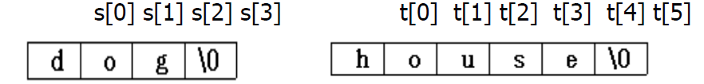

## ADT

> **ADT** String
>
> **Objects** : 0개 이상의 문자들의 유한 집합
> **Functions**:
>    모든 s, t∈String / i, j, m∈음이 아닌 정수
>
> *String*  `Null(m)`
>	 **return** 최대 길이가 m인 스트링을 반환. 초기는 “”로 표현되는 *NULL*로 설정
>
> *Integer*  `Compare(s, t)`
>    **if** (s와 t가 같으면) **return** 0
>    **else if** (s가 t에 선행하면) **return** -1
>    **else return** +1
>
> *Boolean*  `IsNull(s)`
>    **if** (Compare(s,NULL)) **return** *FALSE*
>    **else return** *TRUE*
>
> *Integer*  `Length(s)`
>    **if** (Compare(s, NULL)) s의 문자 수를 반환
>    **else return** 0
>
> *String*  `Concat(s, t)`
>   **if** (Compare(s,NULL) s 뒤에 t를 붙인 스트링을 반환
>   **else return** s
>
> *String*  `Substr(s, i, j)`
>    **if**((j > 0) && (i + j - 1) < Length(s)) s에서 i, i + 1, … , i + j - 1의 위치에 있는 스트링을 반환
>    **else return** *NULL*

## Strings in C

- C에서 문자열은 null(\0)로 끝나는 문자열로 표현한다

```c
#define MAX_SIZE 100
char s[MAX_SIZE] = "dog";
char t[] = "house"; // 크기 지정안하면 저절로 생성
```



→ `strcat(s,t)` 함수를 사용하면 “doghouse”라는 새로운 문자열을 만든다

- 기존 s에 공간을 추가 배정하는 것이 아닌 덮어쓰기 방식으로 만듬.

| 함수 | 설명 |
| --- | --- |
| char *strcat(char *str1, char *str2) | str1과  str2 연결, str1으로 결과 반환 |
| char *strncat(char *str1, char *str2, int n) | str2 중 n개의 문자와 str1 연결, str1으로 결과 반환 |
| char *strcmp(char *str1, char *str2) | 두 스트링 비교. 같으면 0, 다르면 0 아닌 값 |
| char *strmcmp(char *str1, char *str2, int n) | 두 스트링 앞에서부터 n개의 문제 비교. 같으면 0, 다르면 0 아닌 값 |
| char *strcpy(char *str1, char *str2) | str2를 str1으로 복사, str1으로 결과 반환 |
| char *strncpy(char *str1, char *str2, int n) | str2를 str1으로 n개 만큼 복사 , str1으로 결과 반환 |
| size_t strlen(char *s) | s의 길이 반환 |
| char *strchr(char *s, int c) | s 중에서 c의 내용이 처음 나오는 곳의 포인터 반환. 없으면 NULL 반환 |
| char *strchrr(char *s, int c) | s 중에서 c의 내용이 마지막 나오는 곳의 포인터 반환. 없으면 NULL 반환 |
| char *strstr(char *s, char *pat) | s 중에서 pat의 시작을 가리키는 포인터의 반환 |

- [Program 2.12] : 문자열 삽입 함수 strnins

```c
void strnins(char *s, char *t, int i){ // 문자열 t를 s의 i번째 인덱스에 삽입
	char string[MAX_SIZE]; // 새 문자열 만들기
	char *temp = string; // 문자열 포인터 만들고 연결
	
	if(i < 0 || i > strlen(s)) { // 인덱스가 음수거나 s의 길이보다 큰 값이면 에러 발생
		fprintf(strerr, "Position is out of bounds");
		exit(1);
	}
	
	if(!strlen(s)) // s가 빈 문자열이라면
		strcpy(s, t); // 그냥 s에 t 삽입
	else if(strlen(t)) { // t가 빈 문자열이 아니라면
		strncpy(temp, s, i); // s를 i만큼 복사해 temp에 저장
		strcat(temp, t); // t를 temp 뒤에 붙임
		strcat(temp, (s+i)); // s의 i번째 이후 문자열을 temp 뒤에 붙임
		strcpy(s, temp); // temp의 내용을 s로 이동
	}  // s가 중간에 t가 삽입된 문자열로 바뀌었음.
} 	
```

## Pattern Matching

`char pat[MAX_SIZE], string[MAX_SIZE], *t;`  // pat은 패턴, string은 패턴을 찾을 

- `pat` 이 `string` 안에 있는지 확인하기 위해선 :

```c
if (t = strstr(string,p)); //string 중에서 pat의 시작을 가리키는 포인터의 반환
	printf("The string from strstr is: %s", t);
else 
	printf("The pattern was not found with strstr");
```

`t = strstr(string, pat)` 이 반환하는 것

// pat이 string 안에 없을 때 → null pointer

// pat이 string 안에 있을 때 → string 안의 pat 패턴의 시작 포인터 

→ strstr의 문제점

- 우리가 사용하는 컴파일러와 맞지 않음
- 패턴 매칭 함수에 여러 다른 방법들이 있음

- A simple matching algorithm
    - `string` 의 i번째 인덱스마다 `pat == string[i+strlen(pat)-1]` 인지 체크
      
        // pat이 string에 없으면 O(nm)의 시간 복잡도 가짐 (n은 pat의 길이, m은 string)의 길이
        
    - 개선점
        1. 패턴의 길이가 찾으려는 string 보다 클 시 작동 종료
        2. 남은 문자를 찾기 전에 pat의 첫 문자와 끝 문자를 체크


- [Program 2.13] : Pattern matching Program

```c
int nfind(char *string, char *pat) { // pat과 string의 끝 글자 먼저 맞추고, 그 다음 처음부터 패턴 매칭
	int i, j;
	int start = 0; // 탐색 시작할 인덱스
	int lasts = strlen(string) - 1;  // string의 끝
	int lastp = strlen(pat) - 1; // pat의 끝
	int endmatch = lastp; // i부터 pat의 길이 만큼 -> string과 매치
	for(i = 0; endmatch <= lasts; endmatch++, start++) { 
		// pat의 마지막 인덱스가 string의 마지막 인덱스에 갈 때까지 (start, endmatch를 함께 증가시켜 pat의 길이만큼 옮김)
		if(string[endmatch] == pat[lastp]) 
		// 이 시점에서 string에서 pat의 끝 문자를 찾았음 
			for(j = 0, i = start; (j < lastp) && (string[i] == pat[j]); i++, j++) 
				;  // 이제 string의 처음부터 pat과 일치하는 것 찾기
				// j 가 끝은 아니고, string 과 pat이 일치하면 (start ~ endmatch 안에서)
			if(j == lastp) // endmatch 까지 모두 일치하면,
				return start;  // string안에서 pat의 시작 인덱스 반환. (성공!)
	}
	return -1; // 못 찾음
}
```

→ 첫 문자와 끝 문자가 다르면 시간 복잡도 O(m)

→ 첫 문자와 끝 문자가 같으면(최악의 경우) 여전히 시간 복잡도 O(nm)

### KMP Algorithm

- 가장 효율적인 문자열 검색 알고리즘
- 동작 원리
    1. 실패 함수 계산 : 패턴 문자열에 대한 실패 함수(failure funtion)를 계산.
    2. 문자열 검색 : 텍스트와 패턴을 비교할 때, 일치하지 않으면 실패 함수의 값에 따라 이동할 위치를 정해 다시 비교. 
       
        → 이미 비교된 부분 다시 비교하지 않아 검색 효율 높아짐
    
- 실패 함수 : 패턴의 각 인덱스에 대해, 그 인덱스까지의 부분 문자열에서 앞쪽이 일치하는 가장 긴 길이를 계산
    - 첫 번째 문자는 항상 -1
    - 두 번째 문자 이후 : 그 인덱스 값이 pat[전 실패함수 값+1]과 일치하면 +1
    
    ex) 패턴이 `abcabcacab` 라면 실패함수는 [-1, -1, -1, 0, 1, 2, 3, -1, 0, 1]
    
    
    
    
    
- 선언들

```c
#include <stdio.h>
#include <string.h>
#define max_string_size 100
#define max_pattern_size 100
int pmatch();
void fail();
int failure[max_pattern_size];
char string[max_string_size];
char pat[max_pattern_size];
```

- [Program 2.15] : 실패 함수

```c
void fail(char *pat){ // 패턴의 실패 함수 구하기
	int i
	int n = strlen(pat); // 패턴의 길이
	int 
	failure[0] = -1; // 실패 함수의 첫 번째 위치는 항상 0
		for(j = 1; j < n; j++){ // 패턴의 두 번째 인덱스부터 끝까지
			i = failure[j-1];  // 지금 패턴 위치의 한 칸 실패함수 값(맨 앞에서부터의 인덱스)
			while((pat[j] != pat[i+1] && (i >= 0)) // 지금 위치의 값 != 이전에 일치했던 앞쪽 패턴의 다음 문자 && 이전에 일치했던 접두사의 끝 위치가 0보다 클 때(즉 -1이 아닐 때)
				// 즉 패턴 일치가 안됐을 때
				i = failure[i]; // i를 이전에 일치했던 곳으로 이동 (i는 패턴 앞쪽의 인덱스)
			if(pat[j] == pat[i+1]) // 패턴 앞쪽과 일치 했을때
				failure[j] = i + 1; // 실패 함수의 값 1 증가
			else failure[j] = -1; 
		}
}
```

→ 시간 복잡도 : for loop가 한번 밖에 안 나오므로 O(n) = O(strlen(pat))

- 교수님 曰
  
    i 는 패턴의 앞쪽
    
    j 는 패턴 문자열 쭉 가는 것
    
    i, j 매치 되면 failure[j] = i;
    
    i++, j++
    
    매치 안되면 i 를 앞에 값 failure[i-1] + 1
    
    → 앞쪽에서 일치한 마지막 인덱스
    
    
    
- [Program 2.14] : KMP 매칭 함수

```c
int pmatch(char *string, char *pat){ // KMP 패턴 매칭 알고리즘
	int i = 0, j = 0;
	int lens = strlen(string); // string의 길이
	int lenp = strlen(pat); // 패턴의 길이
	while(i < lens && j < lenp){ // 길이 초과하지 않을 때까지
		if(string[i] == pat[j]{ // 일치하면,
			i++; j++;} // i, j 값 증가
		else if(j = 0) i++; // 일단 비교하려면 string부터 증가 시켜야 함 (제일 처음 실행)
		else j = failure[j-1] + 1; // 일치하지 않으면, j는 일치했던 실패함수 값 + 1위치로 이동(jump!)
	}
	return ((j == lenp) ? (i - lenp) : -1);  // 패턴을 찾았다면 그 시작 포인터 위치(i - lenp) 반환, 못 찾으면 -1 반환
}
```

→ 시간 복잡도 : O(m) = O(strlen(string))

- KMP 알고리즘의 총 시간 복잡도 = O(n + m)